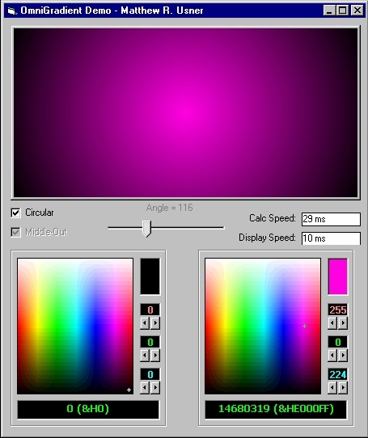



## OmniGradient v1\.00 \- Gradient generation and display module

### Description

Almost all the code in this module was written by one of the VB gurus on PSC, Carles P.V. His original submission can be found on PSC at txtCodeId=60580. In that submission he has two modules. One is for linear gradients that can be displayed at any angle, and the other is for circular gradients. My meager contributions to his excellence: - The linear and circular gradient generating routines have been merged into one routine that handles both gradient styles. - Linear gradients can be generated in a "middle-out" fashion - that is, from Color1 to Color2 back to Color1. Makes a nice 3D effect.

- The code that actually displays the gradient has been removed from Carles' gradient generating routines and placed in a separate

procedure. The reason for that is simple - speed. If you need to refresh the gradient background of a usercontrol often, why recalculate the background gradient information every time? Calculate it ONCE, cache it, and redraw it as needed with a simple PaintGradient call. A demo showing the module's capabilities is included. Feedback is welcome but if you wish to vote, please vote not for this but for Carles' submission at txtCodeId=60580. Thanks.
 
### More Info
 

             |
---                |---
**Submitted On**   |2006-03-18 21:07:02
**By**             |[Option Explicit](https://github.com/Planet-Source-Code/PSCIndex/blob/master/ByAuthor/option-explicit.md)
**Level**          |Intermediate
**User Rating**    |5.0 (20 globes from 4 users)
**Compatibility**  |VB 6\.0
**Category**       |[Graphics](https://github.com/Planet-Source-Code/PSCIndex/blob/master/ByCategory/graphics__1-46.md)
**World**          |[Visual Basic](https://github.com/Planet-Source-Code/PSCIndex/blob/master/ByWorld/visual-basic.md)
**Archive File**   |[OmniGradie1981133182006\.zip](https://github.com/Planet-Source-Code/option-explicit-omnigradient-v1-00-gradient-generation-and-display-module__1-64705/archive/master.zip)

### API Declarations

StretchDIBits

